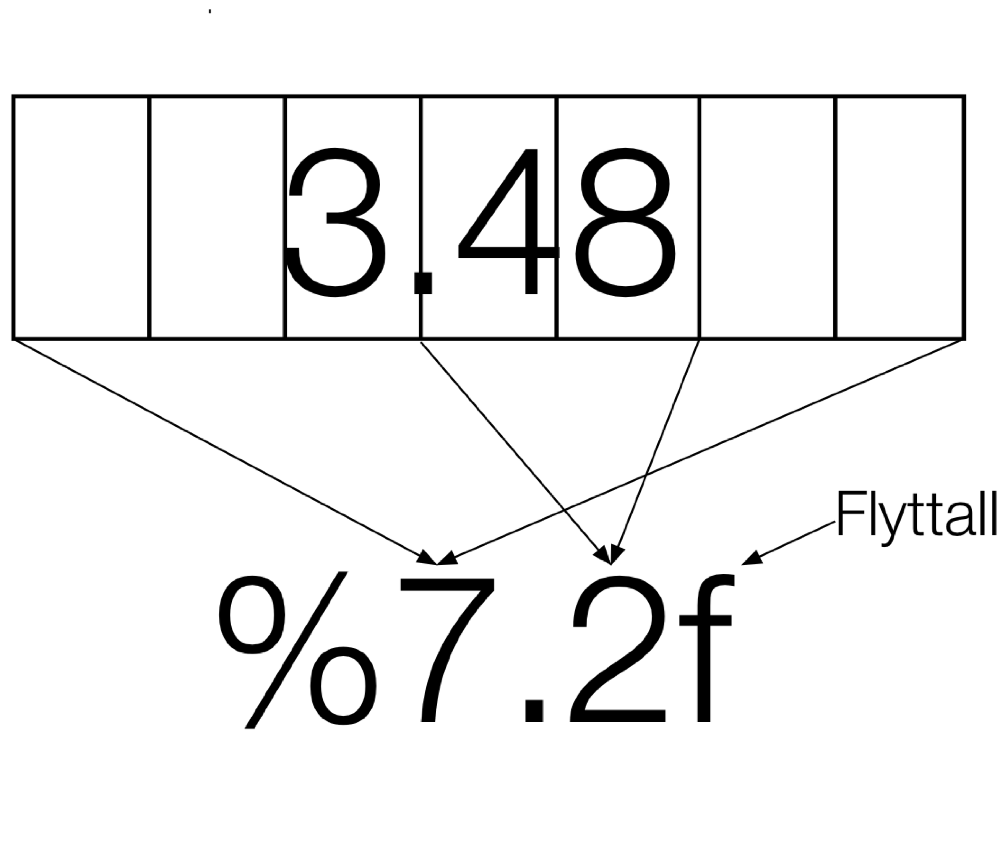

*Kursdag 1, del 2*

I denne delen skal vi lære om input/output, beslutninger, og  funksjoner/prosedyrer.

## Input/Output

Programmer forteller oss ikke hva de gjør med mindre vi ber dem om det. Altså at vi ber om en eller annen form for output. For å skrive ut i konsollen bruker vi `print`-funksjonen. Vi skal snakke mer om funksjoner senere i denne sesjonen. Foreløpig forholder vi oss til at en funksjon er  noe som gjør noe, og som kan returnere noe. Det `print`-funksjonen gjør er at den skriver ting i konsollen. Det er derfor vi kunne se hva knut regnet på i forrige økt.


```python
a = 1 + 2
print(a)

# Det er en ryddig vane å også skrive ut navnet på variabelen
print("a: ", a)
```

    3
    a:  3


La oss se på hvordan vi kan hente input ved at brukeren blir bedt om å skrive noe i konsollen. For å ta input bruker vi `input`-funksjonen. I selve funksjonskallet skriver vi inn hva vi ønsker at skal printes i konsollen rett før brukeren skal gi input. `input`-Funksjonen returnerer det brukeren skrev i konsollen som en streng.  


```python
navn = input("Skriv inn navnet ditt: ")
print("Hello", navn, "!") 
print("navn har type: ", type(navn))
```

    Skriv inn navnet ditt: Henrik
    Hello Henrik !
    navn har type:  <class 'str'>


Vi ser av kjøreeksempelet over at det brukeren skriver inn blir lagret i en variabel `navn` som har type `str`, altså en streng.

### Strengformatering
Vi kan gjøre litt mer sofistikert output ved hjelp av *strengformatering*. Det gjøres ved å lage en streng der noen av tegnene inne i strengen koder for hvordan en variabel skal settes inn på det stedet i strengen. For eksempel kan vi skrive `print("%d" % 4)`, eller `print("%d og %d" % (3, 4))`. Det er da på det stedet der det står `%` etterfulgt av ett eller flere tegn at det vil bli satt inn noe fra en variabel. Hovedfordelen med denne måten å gjøre ting på er at vi kan kontrollere antallet desimaler, hvor stor plass et tall skal ta, og hvorvidt output skal komme på standardform. `"%10.4f" % variabel` ber om et flyttall som skal ta opp 10 tegn med plass, og ha 4 desimaler.

Vi kan også velge å ikke sette hvor stor plass tallet skal ta. Da skriver vi f. eks. `%.2f` for å få et tall med 2 desimaler. Strengformatering er en noe vi gjør med strenger, men det er veldig vanlig å bruke det sammen med print-funksjonen. 


| Symbol        | Betydning    | 
    | ---  |     --- |
| `%d`      | heltall |
| `%m.nf`   | flyttall <br>som tar opp `m` tegn med `n` desimaler      |
| `%m.ne`    | tall på standardform <br>som tar opp `m` tegn med `n` gjeldende siffer      | 
| `%m.ng`    | velger mellom flyttall og standardform automatisk     | 



### Eksempler med strengformatering og output
Under finnes noen eksemplet på bruk av strengformatering.


```python
# I forelesning
minSaldo = 744.37
print("Jeg har %7.2f kroner" % minSaldo)
print("Jeg har %10.4f kroner" % minSaldo)

# Med flere variable
print("%d og %d" % (3, 4))

mittKontonummer = 51005678987
print("Jeg har %7.2f kroner på kontonummer %d" % (minSaldo, mittKontonummer))

# For ordens skyld. Dette med %-notasjon er egentlig noe som hører til strenger, ikke print-fuksjonen. 
minStreng = "Jeg har %7.2f kroner på kontonummer %d" % (minSaldo, mittKontonummer)
print(minStreng)

# Ekstra: bruke standardform i output
variabel = 230.574683646734
print("%8.4e" % variabel)
```

    Jeg har  744.37 kroner
    Jeg har   744.3700 kroner
    3 og 4
    Jeg har  744.37 kroner på kontonummer 51005678987
    Jeg har  744.37 kroner på kontonummer 51005678987
    2.3057e+02


### Input må vanligvis *castes*
Vi nevnte i innføringen av `input`-funksjonen at den returnerer det brukeren skriver inn som `str`, streng. I eksempelet under ser vi hva som kan skje ved forskjellige behandlinger av input. Det er ikke alt som går bra. 


```python
lest_input = input("Skriv inn et tall (prøv både en int, en float og noe som ikke er et tall): ")
print("lest_input har verdi ", lest_input, " og type ", type(lest_input))

float_input = float(lest_input)
print("float_input har verdi ", float_input, " og type ", type(float_input))

float_casted_to_int = int(float(lest_input))
print("float_casted_to_int har verdi ", float_casted_to_int, " og type ", type(float_casted_to_int))

int_input = int(lest_input)
print("int_input har verdi ", int_input, " og type ", type(int_input))
```

    Skriv inn et tall (prøv både en int, en float og noe som ikke er et tall): 456.7
    lest_input har verdi  456.7  og type  <class 'str'>
    float_input har verdi  456.7  og type  <class 'float'>
    float_casted_to_int har verdi  456  og type  <class 'int'>


    ---------------------------------------------------------------------------

    ValueError                                Traceback (most recent call last)

    <ipython-input-11-ee60755aa770> in <module>()
          8 print("float_casted_to_int har verdi ", float_casted_to_int, " og type ", type(float_casted_to_int))
          9 
    ---> 10 int_input = int(lest_input)
         11 print("int_input har verdi ", int_input, " og type ", type(int_input))


    ValueError: invalid literal for int() with base 10: '456.7'


Eksempelet illustrerer at input-funksjonen leser inn det man gir den som en streng. Det er opp til programmereren å velge hvordan denne strengen skal tolkes. Dersom vi sender inn noe som kan tolkes som et tall, så kommer *casting*-funksjonene `int()` og `float()` til å klare å gjøre dem om til tall-datatyper. I dette tilfellet vil vi få feilmeldinger dersom vi sender inn noe som ikke fungerer med casting-operatorene. `int`-funksjonen er ganske streng, og vi gi en feilmelding (ValueError) om den får en streng som ikke er et heltall. Men dersom man har et flyttall synes den det er greit å oversette det til et heltall. Også dersom flyttallet ikke egentlig er et heltall. I så fall tar den bare vekk desimalene. 

### Underveisoppgave
Lag et program som spør hvor mange meter over havet noen befinner seg, og deretter printer `<n> moh er <m> % av høyden til Mount Everest`. 


```python
hoydeStreng = input("Hvor høyt sitter du? ")
hoyde = float(hoydeStreng)
prosentAndel = hoyde/8848*100
print("Du er på %.2f prosent av Mount Everest ved %.2f meter" % (prosentAndel, hoyde))
```

    Hvor høyt sitter du? 345.6
    Du er på 3.91 prosent av Mount Everest ved 345.60 meter


## Beslutninger (if-elif-else-setninger)

I progamflyt ønsker vi ofte at et program skal gjøre forskjellige ting basert på hva som er tilstanden i programmet. For eksempel kan det hende vi er i ferd med å sende inn en variabel til en matematisk funksjon, men at variabelen er utenfor gyldighetsområdet til funksjonen. Da bør vi ha testet på forhånd at variabelen er innenfor gyldighetsområdet, og gitt brukeren en advarsel. (evt: For eksempel skal et billettsystem gjøre forskjellige ting om det detekterer en gyldig billett enn en ugyldig)

if-elif-else-setninger kan skrives på følgende måte:
```python
if <kriterium>:
    <utfør noe>
elif <et annet kriterium>:
    <utfør noe annet>
else:
    <utfør enda noe annet>
```
Her er det flere ting å merke seg. Først: koden under `if` er rykket inn. Det er den koden som er rykket inn som vil bli kjørt dersom `<kriterium>` slår til. 


### Boolske uttrykk
Før vi kan gå løs på dette med `<kriterium>`, må vi egentlig si noe om hva et slikt kriterium er. Og hva det er, det er "sant" eller "usant", i Python `True` eller `False`. Derfor bruker vi gjerne boolske uttrykk. Boolske uttrykk er uttrykk som produserer "sant" eller "usant". Vi har forklart noen boolske uttrykk som kan brukes i Python i tabellen under. 

| Operator        | Betydning    | 
    | ---  |     --- |
| `a == b`      | `True` om `a` og `b` har samme verdi |
| `a > b`   | `True` om `a` har større verdi enn `b`  |
| `a >= b`   | `True` om `a` har større enn eller lik verdi som `b`  |


La oss begynne med det enkleste. Vi har testet en del, og vet at det tar omtrent 5 min å bløtkoke et egg, 7 min å mellomkoke et egg og 9 min å hardkoke et egg. Her bruker vi en if-test. Der skriver vi testen, og deretter må vi *indentere* den blokken med kode som skal eksekvere om testen slår til.


```python
eggeType = input("Hvordan vil du ha egget? \
                 (bløt/smilende/hard) ")

if eggeType == "bløt":
    print("Du må koke egget i 5 minutter")
elif eggeType == "smilende":
    print("Du må koke egget i 7 minutter")
elif eggeType =="hard":
    print("Du må koke egget i 9 minutter")
else:
    print("Jeg vet ikke om slike egg:", eggeType)
    
```

    Hvordan vil du ha egget?                  (bløt/smilende/hard) smilende
    Du må koke egget i 7 minutter


### Underveisoppgave
Forrige oppgave var: Lag et program som spør hvor mange meter over havet noen befinner seg, og deretter printer `<n> moh er <m> % av høyden til Mount Everest`. 

Utvid nå dette programmet til å kommentere brukerens altitude, med flere forskjellige kommentarer avhengig av hvor høyt vedkommende befinner seg. 


```python
hoydeStreng = input("Hvor høyt sitter du? ")
hoyde = float(hoydeStreng)

if (hoyde < 1 and hoyde > 0):
    print("Er du på stranden?")
elif (hoyde > 8500):
    print("Du er kanskje på et fly?")
else:
    print("Jeg har ingenting å si om din altitude..")

```

    Hvor høyt sitter du? 324523465
    Du er kanskje på et fly?


## Funksjoner

Fuksjoner er litt som i matematikken, men også ikke. 
I Python kan en fuksjon ta inn ingen, ett eller flere argumenter, og returnere ingen, en eller flere variable. I spesialtilfellet at det ikke er noen returvariable kan vi kalle funksjonen for en *prosedyre*.

Generelt er syntaks for en funksjon som følgende:
```python
def myFunction(arg1, arg2):
    <gjør noe>
    return <returvariable>
```

Vi skriver ordet `def` for å si til python at det kommer en funksjon, og vi definerer hvilke argumenter funksjonen skal ta. Så kommer `:`, som forteller at vi nå skal gå over til innholdet i funksjonen. Innholdet, eller *det som utføres* ligger på de neste linjene med innrykk, og innholdet i funksjonen fortsetter helt til vi kommet til en linje som ikke er rykket inn *i forhold til* `def`-ordet. Funksjonen sier seg ferdig enten når den når bunnen uten å bli sendt tilbake noe sted, eller når den møter `return`, altså der funksjonen returnerer. Vi kan returnere alt fra ingen til mange variable. Der det er flere enn én returvariabel skiller vi dem med komma. 

Under viser vi fram noen forskjellge fuksjoner. 


```python
def f(x):
    return x**2

def pengespill(bidrag1, bidrag2):
    myVariable = bidrag1 + bidrag2
    if (myVariable > 4):
        return 2*myVariable
    else: 
        return 0

def printKineticEnergy(m, v):
    E_k = m*v**2
    kineticEnergyString = "E_k: %.2f J" % E_k
    print(kineticEnergyString)

print("f(2): ", f(2))

print("Pengespillet gir: ", pengespill(3, 2))
print("Pengespillet gir: ", pengespill(1, 2))

printKineticEnergy(2.3, 3.4)

```

    f(2):  4
    Pengespillet gir:  10
    Pengespillet gir:  0
    E_k: 26.59 J


Over er `printKineticEnergy` et eksempel på en *prosedyre*


```python
# Noen flere eksempler
def g(x): 
    return x**3

def settSammenOrd(arg1, arg2):
    return arg1 + " " + arg2

z = g(3)
sammensattTekst = settSammenOrd("to", "ord")

print("z: ", z)
print("sammensattTekst:", sammensattTekst)
```

    z:  27
    sammensattTekst: to ord


Under bruker vi noe som heter et *keyword argument*. Det vil si en funksjonsparameter som har en standardverdi. Dette er en nyttig måte å definere parametre som ofte bruker en standardverdi, f. eks. naturkonstanter. En annen fin ting med keyword arguments er at de øker lesbaheten i koden. Når man gjør et funksjonskall gjør man det eksplisitt hvilke vedier som tilordnes hvilket argument. 


```python
def f(x, y=0.2):
    return x*y**2

print(f(4))
print(f(2, 3))
print(f(x=2, y=3))
print(f(y=3, x=2)) # Ved bruk av keyword arguments trenger man ikke huske rekkefølgen. 
```

    0.16000000000000003
    18
    18
    18


Legg merke til at her har vi brukt vanlige matematiske operasjoner som gange `*`, dele `/` og minus `-`. I oppgaven under skal vi i tillegg bruke den naturlige logaritmen `log` (den briggske logaritmen heter `log10`). Logaritmen og mange andre funksjoner slik som `sin`, `cos`, `tan`, `exp` kommer av at vi har skrevet `from pylab import *`. Da importerer python en hel masse matematisk og annen hjelp til oss. 


## Et par ord om biblioteker

Vi har brukt kommandoen `from pylab import *`. Dette er en kommando som importerer en rekke biblioteker. Som de sier selv: 
> To make PyLab an easy to use, well packaged, well integrated, and well documented, numeric computation environment so compelling that instead of having people go to Python and discovering that it is suitable for numeric computation, they will find PyLab first and then fall in love with Python.

pylab-importen sørger for at man importerer kjerneelementene i `numpy`, `scipy` og `matplotlib`. `numpy` tilbyr matematiske operasjoner på store *arrays* (ordnede samlinger av homogene data). `scipy` tilbyr alt mulig av vitenskapelige metoder, og baserer seg i stor grad på det som er tilgjengelig i `numpy`. `matplotlib` gjør at man kan plotte. Dersom du leter etter dokumentasjon som beskriver hvordan funksjonene i disse bibliotekene fungerer må du inn på bibliotekene sine nettsider. I praksis er det ofte enklest å Google funksjonsnavnet. Nesten alltid endar du da opp på riktig sted på internett. 
