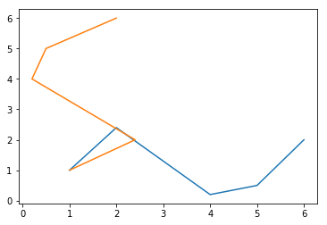
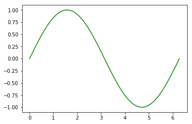

# Plotting
Hvis du fulgte ProFags installasjonsguide for Anaconda og Python, ble du bedt om å kjøre dette scriptet som gir et plot: 


```python
from pylab import *
t = linspace(0, 3, 30)
A = t**2
plot(t, A)

xlabel("tid")
ylabel("amplitude")

show()

```


    <matplotlib.figure.Figure at 0x59dac50>


Nå skal vi legge til et print-statement så du ser hva variabelen t faktisk inneholder


```python
print(t)
```

    [0.         0.10344828 0.20689655 0.31034483 0.4137931  0.51724138
     0.62068966 0.72413793 0.82758621 0.93103448 1.03448276 1.13793103
     1.24137931 1.34482759 1.44827586 1.55172414 1.65517241 1.75862069
     1.86206897 1.96551724 2.06896552 2.17241379 2.27586207 2.37931034
     2.48275862 2.5862069  2.68965517 2.79310345 2.89655172 3.        ]
    

### Underveisoppgave 

Endre t fra 30 til 4 punkter. Beskriv hva det gjorde med plottet ditt. 


### Lister med verdier

Nå tenker vi at vi har data fra logging eller et eksperiment. Noen tider og noen posisjoner. Vi legger dette inn i to lister. 


```python
tid = [1,2,3,4,5,6]     # Lager to lister, tid og posisjon
posisjon = [1.0, 2.4, 1.3, 0.2, 0.5, 2.0]
plot(tid,posisjon)      # Plotter tid på 1.aksen og posisjon på 2.aksen 
# plot(posisjon,tid)      # Plotter posisjon på 1.aksen og tid på 2.aksen
```


    [<matplotlib.lines.Line2D at 0x8edb518>]





>Elevene er vant til x og y. Hvis vi kaller det x og y i programmet så er det kjent, men de venner seg ikke til å tenke «friere» - at man kan bytte om på første- og andreaksen eller kalle det noe helt annet. Det kan derfor være lurt å gi variablene logiske navn og ikke være for bundet av matematisk notasjon. 

Nå ser vi på hvordan vi kan endre på listen med tider. Tenk f.eks. at du egentlig målte hvert andre sekund. Vi prøver først med å ta 2*tid:


```python
nytid=2*tid
print("tid= ", tid)
print("nytid= ", nytid)
```

    tid=  [1, 2, 3, 4, 5, 6]
    nytid=  [1, 2, 3, 4, 5, 6, 1, 2, 3, 4, 5, 6]
    

Du ser at dette ga en dobbelt så lang liste. Tanken var egentlig å lage denne listen: [2,4,6,8,10,12] 
Da må vi konvertere fra liste til vektor (array) før vi ganger med 2. 


>*liste* og *array* er to forskjellige datatyper. Vi kan oversette *array* til matrise eller vektor. Fordi de matematiske regneoperasjonene vi skal gjøre med *arrays* likner på vektorregning har vi valgt å kalle det vektor. I ProFag skal vi for det meste bruke vektorer og unngå lister. NB! `array*array` gir ikke skalarprodukt, men `array*<tall>` tilsvarer regneoperasjon for vektorer. 


```python
nytid=array(tid)      #konverterer fra liste til vektor (casting)
nytid=2*nytid
print(nytid)
```

    [ 2  4  6  8 10 12]
    

### Underveisoppgaver
1. I ditt første plott lagde du variabelen t ved hjelp av kommandoen *linspace*. Lager denne kommandoen en vektor eller en liste?

2. Finn ut hvordan lage ulike vektorer ved hjelp av *zeros* og *ones*. Se f.eks. s. 80 i ProMod-boka. Hvis du vil bruke dette til å lage en vektor som er lik den som heter nytid i vårt program, trenger du kunnskap om løkker. Det kommer i neste økt, men vi gir en smakebit nedenfor. 

3. Hva skjer om du bytter ut kommandoen plot med kommandoen scatter?

4. Prøv deg med farger, linjestil og markeringer. Se eksempel under. 


#### Eksempel på plot med farger, linjestil og markeringer


```python
plot(tid,posisjon, "-.", color="cyan", marker="s")
```


    [<matplotlib.lines.Line2D at 0x8c1ef28>]


#### Eksempel på bruk av løkke for å fylle en vektor med tall vi ønsker


```python
mertid=zeros(6,int)    #lager en vektor med 6 nuller
mertid[0]=2            #setter den første verdien til 2
for i in range(1,6):   #går gjennom løkken seks ganger
    mertid[i]=mertid[i-1]+2
print(mertid)
```

    [ 2  4  6  8 10 12]
    

### Plot av sinusfunksjon
Husk at for å plotte må vi har to vektorer av samme dimensjon. 
For å plotte en sinusfunksjon trenger vi derfor å lage to vektorer. En som inneholder argumentene og en som inneholder funksjonsverdiene. Jo flere punkter vi velger i vektoren, desto glattere blir sinuskurven. 
Her velger vi å plotte sinus for en hel periode. Da trenger vi matematikkbiblioteket både for pi og for sinus. 
Les gjennom program linje for linje og forklar hva som blir gjort.


```python
from pylab import *
vinkel = linspace(0, 2*pi, 100)  #vektor går fra 0 til 2pi, med 100 steg i mellom
sinus=sin(vinkel)                     #husk at vinkelen må være i radianer

plot(vinkel, sinus, c="magenta")
```


    [<matplotlib.lines.Line2D at 0x8c1d780>]


Programmet hadde blitt både mer lesbart og fleksibelt om vi deklarerer variable først. Da kan det se slik ut: 


```python
from pylab import *

#Deklarer variable
start = 0
slutt = 2*pi
N = 100

#Lager vektorer
vinkel = linspace(start, slutt, N)  #vektor går fra 0 til 2pi, med 100 steg i mellom
sinus=sin(vinkel)                     #husk at vinkelen må være i radianer

#Plotter vektorene mot hverandre
plot(vinkel, sinus, c="green")
```


    [<matplotlib.lines.Line2D at 0x8097828>]





>Elever har ikke alltid et like bevisst forhold til om vinkler gis i grader eller radianer. Det kan derfor være nyttig å vite hvoran python konverterer mellom de to. Eller du kan  gi elevene i oppgave å lage en funksjon i python som gjør denne konverteringen. 
Uansett hvilken tilnærming du velger i klassen: Her ser du hvordan du kan konvertere til radianer slik at den innebygde funksjonen *sin*  regner riktig når vinkelmålet blir gitt i grader. 


```python
from pylab import *

a = sin(radians(30))
print("Sinus av 30 grader =",a)

```

    Sinus av 30 grader = 0.49999999999999994
    


### Diskusjon
1. Det går fint an å bruke svært mye tid på å pynte på plot. Hvordan styre dette i klassen?
2. Hva er forskjellen på å plotte i Python og Geogebra? Diskuter fordeler og ulemper med å bruke disse programmene til plotting.


# Lese fra fil
Python-programmer har filending .py
Tekstfiler har filending .txt
Vi skal begynne med å lage en enkel .txt fil som vi leser fra. Vi kan lage denne filen i Spyder. 
Det blir enklest om du legger .txt filen i samme mappe som programmet kjører fra. Hvis ikke må du ha med hele filbanen. 

Åpne en ny fil i Spyder og velg "lagre som" og kall filen f.eks.  tidogposisjon_profag.txt
Legg inn to kolonner med tall. Du trenger bare et vanlig mellomrom mellom tallene. 


```
1 1.0
2 2.4
3 1.3
4 0.2
5 0.5
6 2.0
```

Nå skal du lage et program som kan lese verdiene i denne filen. Det ser slik ut: 


```python
#Lese fra fil
from pylab import *       #må ha med denne for å bruke funksjonen loadtxt
data = loadtxt("tidogposisjon_profag.txt")     #husk at du må ha filen tilgjengelig
tid = data[:,0]           
posisjon = data[:,1]
```

loadtxt har mange muligheter som vi ikke har gått inn på her. Du kan f.eks. hoppe over et gitt antall rader, velge ut spesifikke kolonner etc. 
Hvis du googler "numpy loadtxt" så kan du finne en nettside fra SciPy.org som forklarer dette nærmere. Prøv deg frem :)

Du kan også bestemme hva slags datatype de innleste verdiene skal være. Hvis du ikke gir beskjed, så blir de flyttall. 


```python
#Lese fra fil og bestem typen til dataene
from pylab import *       #må ha med denne for å bruke funksjonen loadtxt
data = loadtxt("tidogposisjon_profag.txt")     #husk at du må ha filen tilgjengelig
print("Nå har jeg ikke skrevet noe bestemt. Da blir det flyttall \n", data)
data = loadtxt("tidogposisjon_profag.txt", int)     #husk at du må ha filen tilgjengelig
print("Nå har jeg bestemt at dataene mine skal være heltall \n", data)
data = loadtxt("tidogposisjon_profag.txt", str)     #husk at du må ha filen tilgjengelig
print("Nå har jeg bestemt at dataene mine skal være strenger \n", data)
```

    Nå har jeg ikke skrevet noe bestemt. Da blir det flyttall 
     [[1.  1. ]
     [2.  2.4]
     [3.  1.3]
     [4.  0.2]
     [5.  0.5]
     [6.  2. ]]
    Nå har jeg bestemt at dataene mine skal være heltall 
     [[1 1]
     [2 2]
     [3 1]
     [4 0]
     [5 0]
     [6 2]]
    Nå har jeg bestemt at dataene mine skal være strenger 
     [['1' '1.0']
     ['2' '2.4']
     ['3' '1.3']
     ['4' '0.2']
     ['5' '0.5']
     ['6' '2.0']]
    

### Underveisoppgaver
1. Forklar hva programmet ovenfor (lese fra fil) gjør ved å lage kommentarer i programmet. Hva kommer til å ligge i variabelen tid? Og hva vil ligge i variabelen posisjon? Sjekk om du hadde rett.

2. Skriv ut de tre variablene data, tid og posisjon og forklar det du ser. 

3. Hva skjer om du bytter ut tid = data[:,0] med tid = data[1:3,0]?

4. Hvordan kan du lage vektorer som dropper de to første verdiene i begge kolonner?


### NB!
Indekseringen i Python starter på 0. Første kolonne er i posisjon null, andre kolonne i posisjon 1 osv. Fort gjort å glemme!

## Solflekkdata
Nå skal vi lese inn data fra en ekstern fil. Filen heter sunspots.txt og er fra http://www-personal.umich.edu/~mejn/cp/programs.html, men du kan finne den på profag sine nettsider. Nå blir det litt mer interessant å bruke programmering til dette :) 

1) Legg data fra filen sunspots.txt i en .txt fil i mappen som kjører Python-programmene dine. 

2) Les inn data fra filen ved hjelp av kommandoen loadtxt. Legg deretter dataene inn i to vektorer. Den første kolonnen i filen beskriver måned etter 1749. Den andre kolonnen i filen er antall solflekker. 

3) Lag et plott av dataene. 


```python
data = loadtxt("sunspots.txt", float)
maaned = data[:,0]                        #første kolonne i datasettet blir lagt i en vektor kalt maaned
antall = data[:,1]                        #andre kolonne i datasettet blir lagt i en vektor kalt antall

#print(maaned,antall)
plot(maaned,antall)
xlabel("måned etter 1749")
ylabel("antall solflekker")
```
