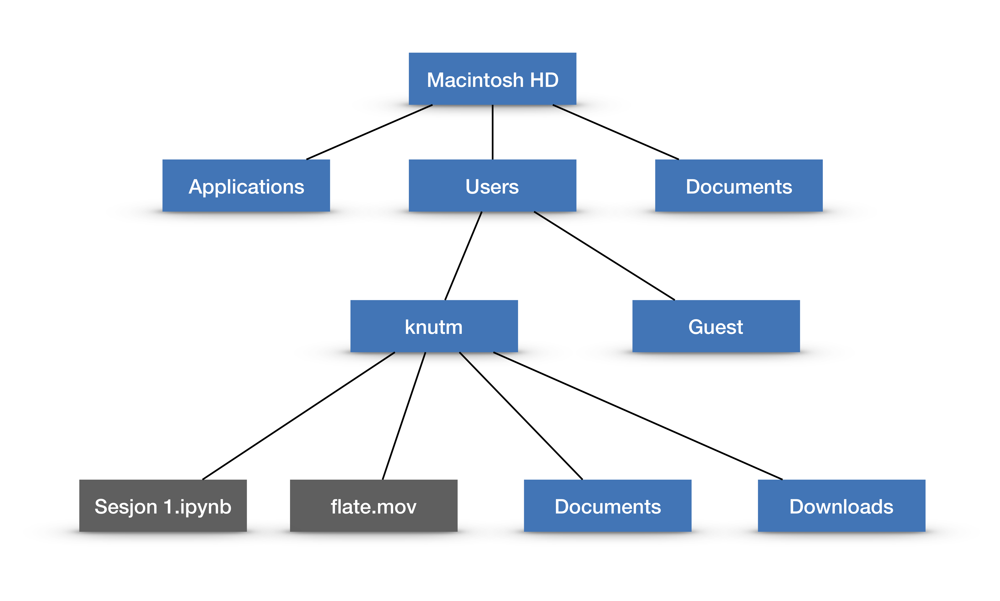

## Forkunnskaper

Før vi begynner å programmere er det greit å si noe om hva vi forventer av kursdeltagerne i ProFag:
    Vi forventer egentlig ingen ting annet enn at dere kan grunnleggende matematikk og naturfag og er vant til å bruke en PC (eller Mac). Dessuten at dere har installert Spyder på maskinen deres og vet hvordan dere starter dette programmet. Og en ting til: at dere har lyst til å lære å programmere!
    

## Hva er programmering og Python?

En datamaskin er ganske primitiv, den er bare i stand til å lese en strøm av nuller og enere, tolke
denne strømmen og utføre det den blir bedt om, om den er i stand til det. Når vi programmerer gjør vi nettopp det,
vi skriver en sekvens av instruksjoner som vi håper kan løse et problem vi er interessert i og lagrer disse
 i en fil (et dokument). Så kan vi be maskinen lese filen, og om
instruksjonene er på et format maskinen forstår vil den gjøre det vi ber den om. Bak kulissene er alt bare
strømmer av nuller og enere, men gjennom lag på lag av elektronikk og logikk er det bygd opp et mer abstrakt grensesnitt
som er mye lettere for et menneske å forholde seg til. Denne prosessen, <em>det å utarbeide en sekvens av instrukser
som en datamaskin kan utføre for å løse et problem vi har, er det vi kaller programmering.</em>

Den mest krevende delen av programmering er å komme fram til en løsning av et problem i form av en sekvens av instruksjoner som datamaskinen kan utføre. Når vi har gjort tenkearbeidet rundt dette og kommet fram til instruksjonene, må vi skrive dem inn i en fil som et program. Da må vi velge et programmeringsspråk med klart definerte regler siden datamaskiner i utgangspunkte er lite fleksible. Python er et slikt språk, og er det språket vi skal bruke i ProFag, men det fins svært mange andre språk.

## Litt om filer og Spyder

Vi skal skrive programmer i Python som lagres i filer og så utføres av datamaskinen. Da må vi ha litt orden på hvor
vi lagrer filene. Dessuten trenger vi en omgivelse med et hendig brukergrensesnitt der vi kan be maskinen lese et Pythonprogram fra en fil, utføre instruksene (kjøre programmet) og gi oss resultatet, vanligvis i form av en utskrift eller et plott. Omgivelsen vi skal bruke heter Spyder og installeres enklest ved hjelp av en annen omgivelse som heter Anaconda. Både Spyder og Anaconda er programmer.

### Filer

Alle datamaskiner har et filsystem for permanent lagring av informasjon. Filsystemet er organisert hierarkisk i mapper (foldere, «directories» på engelsk). Figuren under viser noen av mappene og en fil på min egen Mac laptop. Jeg kan referere til for eksempel mappen «Documents» som «/Macintosh HD/Users/knutm/Documents» og en av filene som «/Macintosh HD/Users/knutm/Sesjon 1.ipynb». Dette kalles filstien til filen «Sesjon 1.ipynb», altså den fullstendige adressen til filen, med sekvensen av mapper fra toppnivået inkludert.



### Spyder

Spyder er en omgivelse der du kan programmere i Python, kjøre programmene dine og se resultatet av kjøringene.
Du finner instruksjoner for hvordan du kan installere Spyder et annet sted på disse nettsidene. Spyder har mange elementer, men det viktigste for vår bruk er et vindu der vi kan skrive inn kode. Dette lagres hele tiden i en fil — du kan lese av navnet med filsti helt øverst i vinduet.

Vi skal senere se at vi med Python kan skrive resultater ut til en fil. Når du kjører programmet du har skrevet inn i programvinduet kommer det opp en linje som ser ut som

<tt>In[1]: runfile('/Users/knutm/.spyder-py3/temp.py', wdir='/Users/knutm/.spyder-py3')</tt>

Dette forteller at Python utfører kommandoene i den første fila («temp.py» med full filsti) og lagrer eventuelle resultater som skrives til fil i mappen med filsti gitt etter «wdir=». Både filstier og filnavn kan endres av brukeren.

## Det første Python-programmet

Vi er nå klare til å skrive det første Python-programmet. Det gjør du ved å skrive inn den siste linjen under i programmeringsvinduet i Spyder (de øvrige linjene har Spyder selv satt inn for deg).


```python
#!/usr/bin/env python3
# -*- coding: utf-8 -*-
"""
Created on Sun Jun  3 15:30:29 2018

@author: knutm
"""

print("Hello World")
```

Når du har gjort det trykker du på den grønne pila («run-knappen») øverst i vinduet. Da skal du i resultatvinduet (vanligvis vinduet til høyre) få utskriften.


```python
Python 3.6.3 |Anaconda custom (64-bit)| (default, Oct  6 2017, 12:04:38)
Type "copyright", "credits" or "license" for more information.

IPython 6.2.1 -- An enhanced Interactive Python.

In[1]: runfile('/Users/knutm/test.py', wdir='/Users/knutm')
Hello World
```

Legg merke til at under linja som begynner med «In[1]» står det «Hello world». Dette er resultatet programmet ditt produserte. Kanskje ikke så veldig spennende, men datamaskinen har gjort det du ba den om! 

### Underveisppgave 

Før du går videre kan du endre det første programmet ditt. Prøv å endre teksten, fjern en parentes eller en av de to ". Husk at du må trykke på den grønne pila for å få utført programmet ditt.

## Enkel aritmetikk kombinert med utskrift

I det andre programmet skal vi begynne å regne med tall. Fjern programlinjen fra det første programmet og skriv inn
koden under i steden. Det er viktig at anførselstegnene er riktige, de skal være som i programmet under.


```python
#!/usr/bin/env python3
# -*- coding: utf-8 -*-
"""
Created on Sun Jun  3 15:30:29 2018

@author: knutm
"""

print("1+2")
print(1+2)
print("1+2=",1+2)
```

Hvis du nå trykker på «run-knappen» skal du i utskriftsvinduet få tre linjer:
<tt>
1+2<br/>
3<br/>
1+2= 3

Dette illustrerer forskjellen mellom de to datatypene tekst og heltall. Du skriver inn tekst ved å omslutten den med anførselstegn, mens heltall skrives inn uten anførselstegn. Legg merke til at `print("1+2=",1+2)` skriver ut både en tekst og et heltall.

### Underveisppgave

Gjør endringer i programmet over og se hva som skjer. Prøv å bruke andre matematiske operasjoner.

## Aritmetiske operasjoner

Python har naturlig nok de vanlige aritmetiske operasjonene innebygget. Disse angis ved `+` (addisjon), `-` (subtraksjon), `*` (multiplikasjon) og `/` (divisjon). Du kan også bruke `**` som angir eksponensiering. `x**y` betyr $x^y$.

Legg merke til at $3/4$ gir som svar 0.75. Dette kan virke naturlig, men det betyr at en operasjon med to heltall blir et desimaltall, vi ender altså utenfor datatypen heltall selv om vi begynner der. Python har en annen divisjonsoperator som gir heltallig svar, nemlig $//$. For eksempel blir $3//4=0$ (desimaldelen av svaret ignoreres).


```python
print(2+3*4)
print((2+3)*4)
print(2+3*4-8/2)
```

### Underveisoppgave

Bruk programmet du allerede har skrevet inn og eksperimenter med de ulike aritmetiske operasjonene.

## Programmering med variable

Det blir etterhvert begrensende å skulle gjøre alle beregninger med eksplisitte tall. Som i matematikk kan vi derfor bruke variable når vi programmerer.


```python
a = 2*3
b = 4*a
print("b=",b)
```

Legg merke til at du ikke kan skrive $4a$, multiplikasjonen må angis eksplisitt.

### Underveisoppgave

Programmer noen formler som involverer de ulike aritmetiske operasjonene. Bruk variable.

### Programmering av en formel

Formler er en sentral del av matematikk og naturvitenskap. Fra mekanikken vet vi at et objekt som beveger seg med konstant aksellerasjon $a$, starthastighet $v_0$ har tilbakelagt en strekning $s$ etter $t$ sekunder, der $s$ er gitt ved
$$
s = v_0 + 0.5 a t^2.
$$
La oss se hvordan denne formelen kan programmeres.

Bevegelsen er definert ved starthastigheten $v_0$ og aksellerasjonen $a$ — dette utgjør konstanter som vi kan tenke på som inngangsdata. Tiden $t$ vil typisk variere, mens $s$ er resultatet. 


```python
# 
# Programmering av bevegelsesformelen
# s = v0 + 0.5 a t^2 der v0 er startfart, a aksellerasjon og s er tilbakelagt strekning etter t seksunder.
#

v0 = 10 # Gitt i meter / sekund
a = 9.81 # Aksellerasjon gitt i meter / sekund^2

# Vi vil vite hvor langt objektet har falt etter 7 sekunder

t = 7 # Gitt i sekunder

# Vi kan programmere formelen direkte

s = v0 + 0.5*a*t**2 # 

# Til slutt skriver vi ut resultatet

print("Tilbakelagt strekning etter %.2f sekunder = %.2f meter" %(t, s))
```

    Tilbakelagt strekning etter 7.00 sekunder = 250.34 meter


Her har jeg skrevet inn en god del kommentarer for å gjøre det lett å forstå hva programmet gjør og brukt blanke linjer for å gjøre det lettere å lese programmet. Dette er noe alle erfarer er lurt: Du trenger kanskje ikke kommentarene når du sitter der og programmerer, men det gjør det mye lettere for andre å lese koden din. Og andre inkluderer deg selv når det har gått litt tid!

Legg også merke til at linjen med print er litt mer avansert enn før, dette kommer vi tilbake til senere.

### Underveisoppgave

Programmer formelen for løsning av annengradsligningen $a x^2 + b x+ c =0$,
$$
x = \frac{-b\pm\sqrt{b^2-4ac}}{2a}.
$$

## Litt mer om variable

I matematikk bruker vi variable på litt forskjellige måter uten å tenke så mye over det. Tenk for eksempel over
hva variablene betyr i de tre uttrykkene
$$
f(x) = \sin x, \qquad \sum_{i=1}^n i, \qquad 3x+ 4=2.
$$

I programmering er en variabel noe langt mer konkret.

<em> En variabel refererer til en lagerplass i datamaskinen som kan inneholde en verdi av en gitt type.</em>
    
For enkelhets skyld kan vi tenke oss at en datamaskin inneholder mange skuffer som kan inneholde en verdi av en gitt type. Med en variabel kan vi sette navn på en slik skuff.

Med en slik forståelse kan vi bedre forklare hva som skjer når datamaskinen utfører programmet under som består av det vi kaller to tilordninger:


```python
a = 2*3
b = 4*a
```

Først multipliseres de to heltallene 2 og 3 og resultatet lagres i variabelen (skuffen) med navn 'a'. Deretter hentes verdien i skuffen ved navn 'a' fram igjen, multipliseres med 4 og resultatet lagres i skuffen med navn 'b'.

Dette illustrerer det grunnleggende prinsippet for hvordan tilordninger gjennomføres:

<em> En tilordning utføres ved at alle variable på høyre siden av likhetstegnet erstattes med innholdet i de aktuelle variablene, operasjonene på høyre siden utføres på vanlig måte og resultatet lagres i variabelen på venstre side.</em>

### Underveisoppgaver

Hva blir resultatet av de to operasjonene


```python
a = 10
a = a + 5
```

Du har to variable ${\tt a}$ og ${\tt b}$ som begge innholder tall av samme type. Skriv et program som bytter innholdet i de to variablene.

## Rekkefølgen på operasjoner og parenteser

Python følger vanlige konvensjoner i matematikk når aritmetiske uttrykk skal regnes ut.
Dette kan overstyres ved hjelp av parenteser, akkurat som i matematikk. Forskjellen er at i matematikk trenger vi ikke
være så nøye, iallfall ikke om det er bare vi selv som skal lese matematikken. En datamaskin er langt mindre fleksibel.
Vi minner derfor om reglene for å regne ut lengre uttrykk.

Et aritmetisk uttrykk regnes ut ved å gå gjennom uttrykket fra venstre til høyre flere ganger.

- Først utføres alle operasjoner inne i parenteser. Nestede parenteser løses opp ved å begynne med det innerste
nivået og gjøre bruk av de tre reglene under.
- Deretter utføres alle eksponensieringer, i rekkefølge fra venstre mot høyre. Merk at eksponenter regnes ut før
grunntallet.
- Etter dette utføres alle multiplikasjoner og divisjoner, fra venstre mot høyre.
- Til slutt utføres alle addisjoner og subtraksjoner, fra venstre mot høyre.
    
Under finner du noen eksempler.

## Underveisoppgave

Programmer ulike uttrykk og sjekk at du forstår hvorfor resultatet blir som det blir.

Noen eksempler:

Hva blir `1+2*6/4*8-1`?

Hvordan programmerer du brøken
$$
\frac{a+b}{c+d}?
$$

Hva blir `2**3**2`?


## Litt mer om talltyper

Vi har tidligere nevnt at Python skiller mellom heltall og desimaltall. I enkle situasjoner trenger vi ikke bry oss
så mye om det, men vi kommer raskt i situasjoner der forskjellen betyr noe. For å forstå dette må vi forstå litt bedre hvordan en datamaskin håndterer tall.

Vi vet at det  fins ingen grense for hvor mange sifre et heltall kan ha. Samtidig har enhver datamaskin endelige ressurser. Det betyr at det må settes en grense for hvor store heltall vi kan operere med.

<em> En vanlig datamaskin kan bare behandle heltall som ligger i intervallet $-2^{63}$ og $2^{63}-1$.</em>

Nå er Python så hjelpsom at når disse grensene overskrides så slår noen Python-funksjoner inn og redder oss. Det betyr at Python ikke protesterer om vi forsøker å regne ut $3^{4000}$, vi får resultatet eksakt som et tall med mer enn 1900 sifre. Det kan virke imponerende, men før eller siden vil også denne programvaren svikte oss ved at utregningen tar for lang tid eller krever for mye minne, ressursene er og blir begrenset.

Situasjonen er mer delikat med desimaltall. Dette kommer av at det ikke fins noen grense for hvor mange sifre et desimaltall kan ha verken til venstre eller høyre for desimalpunktet. Som for heltall kan vi bare representere et endelig antall sifre også for desimaltall. Det betyr at vi både må begrense størrelsen (antall sifre til venstre for desimalpunktet) og antall desimaler (antall sifre til høyre for desimalpunktet).

<em> En vanlig datamaskin regner med omtrent 16 desimale sifre, og desimaltall på datamaskin kalles flyttall.</em>

### Avrundingsfeil

Det å begrense størrelsen på et desimaltall er ikke så kritisk, men det å begrense antall desimaler viser seg
å være mer dramatisk. La oss se på et eksempel.


```python
b = 2**0.5
a = b*b

print(a)
print(a-2)
```

gir utskriften
$$
2.0000000000000004\\
4.440892098500626e-16
$$

Vi ser at $a$ er gitt ved $a=\bigl(2^{1/2}\bigr)^2$, med andre ord skal $a$ bli $2$. Vi ser imidlertid at 16. desimal blir 4. Når vi trekker fra 2 ser vi enda tydeligere at $a$ ikke er 2.

Feilen kommer omtrent i 16. siffer fordi datamaskinen regner ut kvadratroten av 2 med omtrent 16 riktige sifre. Dette er kanskje ikke så overaskende, men det er også andre finurligheter med flyttall.

### Rasjonale tall og avrundingsfeil

Vi vet at tallet $1/3$ skrevet som desimaltall blir tallet $0.333333\cdots$ der $\cdots$ antyder uendelig mange desimaler som alle er $3$. Hvis vi forsøker oss i Python med


```python
print(1/3)
```

blir resultatet $0.3333333333333333$, altså 16 desimaler som alle er 3. Samtidig vet vi at dette ikke er riktig. Og hvis vi lurer Python til å skrive ut flere sifre med


```python
print("%0.20f" % (1/3))
```

får vi resultatet $0.33333333333333331483$. Vi ser at etter 3-tallene dukker det opp nye desimaler som ikke er 3.

La oss se på et eksempel til. En del rasjonale tall kan representeres eksakt som desimaltall. Et eksempel er $1/10$. Hvis vi skriver 20 desimaler for dette tallet med


```python
print("%0.20f" % 0.1)
```

får vi svaret  0.10000000000000000555. Dette er overaskende for de fleste fordi vi er så vant til at alle rasjonale tall med nevner som er en potens av 10 kan representeres eksakt med desimaltall.
Et siste eksempel er tallet  1/4=0.25. Hvis vi gjør den samme øvelsen med


```python
print("%0.20f" % (1/4))
```

får vi svaret  0.25000000000000000000, alså ingen feil.

Forklaringen på begge de to siste eksemplene er at datamaskinen representerer og regner med tall i 2-tallsystemet. I dette siffersystemet er de eneste rasjonale tallene som kan representeres eksakt de som har en potens av 2 i nevner.
De eneste desimaltallene som kan representeres eksakt i datamaskinenen er med andre ord rasjonale tall på formen $m/2^n$
  der  $m$
  er et heltall og  $n$
  er et positivt heltall som ikke er for stort.
Tallet  1/10
  er ikke på denne formen, det har også en faktor 5 i nevneren, og kan derfor ikke representeres eksakt i datamaskinen.

### Begrensninger og muligheter

Datamaskinen ble designet spesielt for å være en regnemaskin, og dagens maskiner gjør ikke skam på dette. En vanlig PC kan utføre mer enn $10^{12}$ aritmetiske operasjoner i sekundet. Dette gir uante muligheter, ikke minst helt andre løsningsmetoder for mange matematikkproblemer enn de tradisjonelle basert på papir og blyant. Samtidig har vi også sett at datamaskinen har grunnleggende begrensninger, særlig når den skal håndtere reelle tall (desimaltall). Avrundingsfeil kan få katastrofale følger fordi de kan forurense en sekvens av beregninger slik at alle sifre i resultatet blir feil. I utvikling og bruk av numeriske beregningsmetoder står det derfor sentralt å forsøke å estimere effekten av avrundingsfeil og andre feilkilder.

Til slutt er det viktig å understreke at datamaskinen ikke tenker, den regner. Det betyr at det er vi mennesker som må ta oss av tenkearbeidet. Det betyr at matematisk tenkesett er minst like viktig som før, ikke minst for å utvikle beregningsmetoder og analysere dem.
