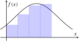
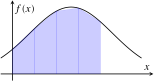

```python
from pylab import *
```

# Numeriske metoder

## Introduksjon
Numeriske metoder er en samlebetegnelse for metoder som finner tilnærmede løsninger til matematiske problemer. Hovedområdene vi skal gå inn på er derivasjon, integrasjon og likningsløsing (inkludert differensiallikninger). Dette er metoder hvor idéen er enkel (f.eks. arealet under en graf) men de analytiske metodene kan være vanskelige (substitusjon, delbrøksoppspalting osv.).

Enkle idéer kan ofte oversettes til enkle algoritmer. Kombinert med regnekraften i moderne datamaskiner kan disse brukes til å finne tilnærmede svar på problemet, ofte med så stor nøyaktighet som vi selv ønsker. Numerisk matematikk er fagfeltet som omhandler utviklingen og karakteriseringen av slike algoritmer. Eksempelvis er det viktig å vite om visse krav må oppfylles for at en algoritme skal fungere, eller hvor raskt den konvergerer.

Siden algoritmene er ukompliserte og krever få forkunnskaper, håper vi at en utledning fra grunnprinnsipper kan føre til bedre dybdelæring av de matematiske konseptene. Slik kommer man også vekk fra «black box»-verktøy som `NLøs` i GeoGebra.

De numeriske metodene har også fordelen av å være mer generelle. En algoritme for numerisk integrasjon bryr seg ikke om hva slags funksjon som skal integreres så lenge vi kan regne ut funksjonsverdier, i motsetning til de analytiske teknikkene. Følgelig kan de numeriske teknikkene også anvendes på vanskeligere, gjerne mer virkelighetsnære, problemer, f.eks. bevegelseslikninger med luftmotstand.

## Derivasjon

Hva er egentlig derivasjon? Hva er den deriverte av $\sin x$? I 1T introduseres elevene til definisjonen av den deriverte, med stigningstall, grenseverdier osv. Deretter går elevene raskt i gang med å lære seg derivasjonsregel etter derivasjonsregel, hvorav få utledes, inntil elevene er i stand til å derivere de fleste «vanlige» funksjoner. Disse derivasjonsreglene blir så elevenes sorte bokser når de skal løse oppgaver.

Numerisk derivasjon går tilbake til den grunnleggende idéen - stigningstall. Den enkleste numeriske metoden er rett og slett å begynne med definisjonen av den deriverte i et punkt $a$,
$$
    f'(a) = \lim_{\Delta x \to 0} \frac{f(a + \Delta x) - f(a)}{\Delta x},
$$
velge $\Delta x$ som et lite tall og regne ut
$$
    f'(a) \approx \frac{f(a + \Delta x) - f(a)}{\Delta x}.
$$
Denne metoden kalles den asymmetriske Newton-kvotienten.

Eksempel:


```python
a  = pi/3
dx = 1e-4
(sin(a + dx) - sin(a))/dx
```


    0.49995669789693054


Som vi ser, gir dette en god tilnærming. Ved å eksperimentere med forskjellige verdier av `dx` vil du se at feilen er proporsjonal med $\Delta x$. En bedre metode er den symmetriske Newton-kvotienten,

$$
    f'(a) \approx \frac{f(a + \Delta x) - f(a - \Delta x)}{\Delta x}.
$$

Med denne metoden er feilen proporsjonal med *kvadratet* av $\Delta x$.

### Oppgave
- Velg din favorittfunksjon og et punkt hvor verdien av den deriverte er kjent. Bruk Python til å regne ut en tilnærming til den deriverte i dette punktet.
- Varier $\Delta x$. Lag en tabell med $\Delta x$ og feilen. La $\Delta x$ variere fra f.eks. $10^{-1}$ til $10^{-15}$.
- Sammenlign resultatene for de to nevnte tilnærmingene til $f'(a)$.

## Integrasjon
Integrasjon er et annet område av skolematematikken med enkelt prinsipp (finn arealet under grafen) og kompliserte metoder (substitusjon, delvis integrasjon osv.).

Definisjonen av et integral er via Riemannsummer, men dette er kun en formalisering av utregningen av et areal. Den enkleste numeriske metoden er rektangelmetoden:

En enkel forbedring er trapesmetoden:

Disse metodene er både konseptuelt og programmeringsmessig enkle, selv om de løser et så vanskelig problem som
$$
    \int_0^{\frac{3}{4}} \mathrm{e}^{-4\left(x-\frac{1}{2}\right)^2} \, \mathrm{d}x.
$$

## Differensiallikninger
Eulers metode er den enkleste metoden for å løse differensiallikninger. Denne algoritmen baserer seg på prinsippene bak numerisk derivasjon.

Et enkelt eksempel er bevegelseslikningene man får fra Newtons andre lov,

$$
    \frac{\mathrm{d}x}{\mathrm{d}t} = v \qquad \text{og}\qquad \frac{\mathrm{d}v}{\mathrm{d}t} = a = \frac{\sum F}{m},
$$

hvor kreftene kan avhenge av både posisjon, hastighet og tid. Akselerasjonen avhenger derfor av disse, og kan skrives $a(x, v, t)$.

Innsatt tilnærmingen til den deriverte blir

$$
    \frac{x(t + \Delta t) - x(t)}{\Delta t} \approx v(t) \qquad \text{og}\qquad \frac{v(t + \Delta t) - v(t)}{\Delta t} \approx a(t),
$$

og disse likningene kan løses for $x(t+\Delta t)$ og $v(t+\Delta t)$,

$$
    x(t + \Delta t) = x(t) + v(t)\Delta t \qquad \text{og}\qquad v(t + \Delta t) = v(t) + a(t)\Delta t.
$$

Når startposisjonen $x(0)$ og starthastigheten $v(0)$ er gitt, kan $x(i\cdot\Delta t)$ og $v(i\cdot\Delta t)$ tilnærmes med gjentatt bruk av disse formlene.

Hoveddelen av koden kan se slik ut:
```python
for i in range(N):
    a[i]   = F(t[i],s[i],v[i])/m
    v[i+1] = v[i] + a[i]*dt
    s[i+1] = s[i] + v[i]*dt
```
Her er `F` en funksjon som gir summen av kreftene.

Legg merke til at kreftene bare inngår ett sted, nemlig i funksjonen `F`. Simulering av ulike fysiske systemer er derfor veldig enkelt - det holder å endre én linje i programmet. Eulers metode gjør det derfor mulig å simulere realistiske systemer som ville vært for vanskelige å modellere med konvensjonell skolematematikk.

## Likninger (nullpunkter)
Siden differansen mellom to sider av en likning skal være $0$, kan likningsløsing omskrives til å finne nullpunktet for en funksjon $f(x)$.

Skjæringssetningen sier at dersom funksjonen $f$ er kontinuerlig og $f(a)$ og $f(b)$ har forskjellig fortegn, har $f$ et nullpunkt $m$ i det åpne intervallet $(a,b)$.

Halveringsmetoden er en svært enkel metode som består av følgende steg:
- Gjett på $m = \tfrac{1}{2}(a+b)$.
- Dersom $f(m)=0$ eller $\mid b-a\!\mid\, < \varepsilon$: Suksess!
- Dersom $f(a)$ og $f(m)$ har forskjellig fortegn: Gjenta med $b=m$.
- Dersom $f(m)$ og $f(b)$ har forskjellig fortegn: Gjenta med $a=m$.

Se [folk.uio.no/anjohan/Halveringsmetoden.html](https://folk.uio.no/anjohan/Halveringsmetoden.html) for en animasjon.

Kodeeksempel:
```python
while abs(b-a) > toleranse:
    m = (a+b)/2
    if f(a)*f(m) < 0:
        b = m
    elif f(b)*f(m) < 0:
        a = m
    else:
        break
```
