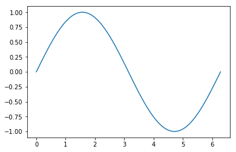

# Dag 1 Del 3 Plotting

## Plotting
Du plottet kanskje da du installerte Python og ble bedt om å kjøre dette scriptet: 


```python
from pylab import *
t = linspace(0, 3, 30)
A = t**2
plot(t, A)
xlabel("tid")
ylabel("amplitude")

```

Nå skal vi legge til et print-statement så du ser hva variabelen t faktisk inneholder


```python
print(t)
```

Endre t fra 30 til 10 punkter og se hva som skjer…

### Didaktisk NB!
Elevene er vant til x og y. Hvis vi kaller det x og y i programmet så er det kjent, men de venner seg ikke til å tenke «friere» - at man kan bytte om på første- og andreaksen eller kalle det noe helt annet. Det kan derfor være lurt å gi variablene logiske navn og ikke være for bundet av matematisk notasjon. 
La oss prøve. Tenk f.eks. at du har data fra logging eller et eksperiment.


```python
tid = [1,2,3,4,5,6]     # Lager to lister, tid og posisjon
posisjon = [1.0, 2.4, 1.3, 0.2, 0.5, 2.0]
plot(tid,posisjon)      # Plotter tid på 1.aksen og posisjon på 2.aksen 
plot(posisjon,tid)      # Plotter posisjon på 1.aksen og tid på 2.aksen
```

Hva om jeg vil ha 2*tid? Jeg målte jo egentlig hvert andre sekund…


```python
nytid=2*tid
print("Tid= ", tid)
print("Nytid= ", nytid)
```

Hmmmm. Jeg ville egentlig ha  [2,4,6,8,10,12]…
Vi må konvertere fra liste til vektor (array)

### Programmerings NB! 
*liste* og *array* er to forskjellige datatyper. Vi kan oversette *array* til matrise eller vektor. Fordi de matematiske regneoperasjonene vi skal gjøre med *arrays* likner på vektorregning har vi valgt å kalle det vektor. I ProFag skal vi for det meste bruke vektorer og unngå lister. 


```python
nytid=array(tid)	#konverterer fra liste til vektor
nytid=2*nytid
print(nytid)
```

### Oppgaver
1) I ditt første plott lagde du variabelen t ved hjelp av kommandoen *linspace*. Lager denne kommandoen en vektor eller en liste?

2) Finn ut hvordan lage ulike vektorer ved hjelp av *zeros* og *ones*. Se f.eks. s. 80 i ProMod-boka. Hvis du vil bruke dette til å lage en vektor som er lik den som heter nytid i vårt program, trenger du kunnskap om løkker. Det kommer i neste økt, men vi gir en smakebit nedenfor. 

3) Hva skjer om du bytter ut kommandoen plot med kommandoen scatter?

4) Prøv deg med farger, linjestil og markeringer. Se eksempel under. 

#### Eksempel på plot med farger, linjestil og markeringer


```python
plot(tid,posisjon, "-.", color="cyan", marker="s")
```

#### Eksempel på bruk av løkke for å fylle en vektor med tall vi ønsker


```python
mertid=zeros(6,int)    #lager en vektor med 6 nuller
mertid[0]=2            #setter den første verdien til 2
for i in range(1,6):   #går gjennom løkken seks ganger
    mertid[i]=mertid[i-1]+2
print(mertid)

```

### Plot av sinusfunksjon
Husk at for å plotte må vi har to vektorer av samme dimensjon. 
For å plotte en sinusfunksjon trenger vi derfor å lage to vektorer. En som inneholder argumentene og en som inneholder funksjonsverdiene. Jo flere punkter vi velger i vektoren, desto glattere blir sinuskurven. 
Her velger vi å plotte sinus for en hel periode. Da trenger vi matematikkbiblioteket både for pi og for sinus. 
Les gjennom program linje for linje og forklar hva som blir gjort.


```python
import math
x= linspace(0, 2*math.pi, 100)  
sinus=sin(x)
plot(x, sinus)
```


    [<matplotlib.lines.Line2D at 0x8fd6d30>]





## Her trenger vi noe med hvordan konvertere mellom radianer og grader...
